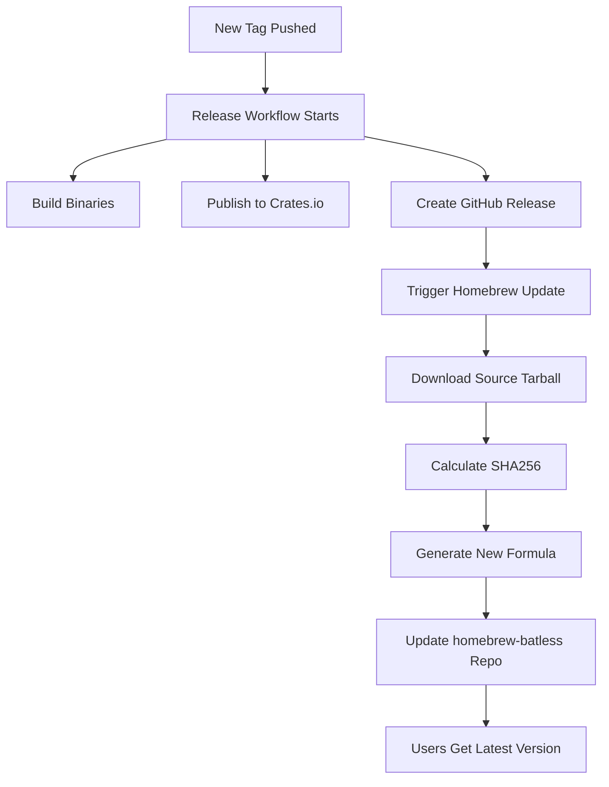

# 🍺 Homebrew Tap Automation Setup

This document explains how to set up automated Homebrew tap updates for `batless` so that every release automatically updates the Homebrew formula.

## 🎯 Goal

When you release a new version of `batless` (e.g., v0.1.6), the Homebrew tap at `https://github.com/docdyhr/homebrew-batless` should automatically update so users always get the latest version when they run:

```bash
brew tap docdyhr/batless
brew install batless
```

## 🔧 How It Works

The automation consists of two workflows:

1. **Release Workflow** (`release.yml`) - Triggers on new tags/releases
2. **Homebrew Update Workflow** (`update-homebrew.yml`) - Updates the tap repository

### Workflow Sequence



## 🛠️ Setup Instructions

### Step 1: Create GitHub Personal Access Token

1. Go to GitHub Settings → Developer settings → Personal access tokens → Tokens (classic)
2. Click "Generate new token (classic)"
3. Configure the token:
   - **Name**: `Homebrew Tap Automation`
   - **Expiration**: No expiration (or 1 year)
   - **Scopes**: Select `repo` (Full control of private repositories)
4. Click "Generate token"
5. **IMPORTANT**: Copy the token immediately (you won't see it again)

### Step 2: Add Token to Repository Secrets

1. Go to your `batless` repository on GitHub
2. Navigate to Settings → Secrets and variables → Actions
3. Click "New repository secret"
4. Add the secret:
   - **Name**: `HOMEBREW_TAP_TOKEN`
   - **Value**: Paste the token from Step 1
5. Click "Add secret"

### Step 3: Verify Workflow Files

Ensure these workflow files exist in your repository:

- `.github/workflows/release.yml` ✅ (already exists)
- `.github/workflows/update-homebrew.yml` ✅ (newly created)

### Step 4: Test the Automation

1. **Create a test release**:

   ```bash
   # Create and push a new tag
   git tag v0.1.6-test
   git push origin v0.1.6-test
   ```

2. **Monitor the workflows**:

   ```bash
   # Watch the release workflow
   gh run list --workflow="release.yml"

   # Watch the homebrew update workflow
   gh run list --workflow="update-homebrew.yml"
   ```

3. **Verify the homebrew tap was updated**:
   - Check <https://github.com/docdyhr/homebrew-batless/commits>
   - Look for automated commit from `batless-bot`

## 🔍 Troubleshooting

### Common Issues

#### 1. `HOMEBREW_TAP_TOKEN` Not Set

**Error**: `HOMEBREW_TAP_TOKEN secret is not set`

**Solution**: Follow Step 2 above to add the token to repository secrets.

#### 2. Permission Denied

**Error**: `Permission denied` when updating homebrew tap

**Solution**:

- Ensure the token has `repo` scope
- Verify the token hasn't expired
- Check that the token belongs to an account with write access to `homebrew-batless`

#### 3. Workflow Not Triggering

**Problem**: Homebrew update doesn't start after release

**Check**:

```bash
# Verify the release workflow completed successfully
gh run list --workflow="release.yml" --limit 1

# Check if update-homebrew workflow was triggered
gh run list --workflow="update-homebrew.yml" --limit 1
```

#### 4. Formula Validation Fails

**Error**: `Formula syntax is valid` fails

**Common causes**:

- Network issues downloading source tarball
- Incorrect SHA256 calculation
- Malformed Ruby syntax in formula template

### Manual Trigger

If automatic triggering fails, you can manually update the Homebrew tap:

```bash
# Trigger the homebrew update workflow manually
gh workflow run update-homebrew.yml -f version=0.1.6 -f tag=v0.1.6
```

## 📊 Monitoring

### Workflow Status

Check automation status:

```bash
# Recent workflow runs
gh run list --limit 10

# Specific workflow status
gh run list --workflow="update-homebrew.yml" --limit 5

# Watch a specific run
gh run watch <run-id>
```

### Homebrew Tap Status

Verify the tap is updated:

```bash
# Check latest commits to homebrew tap
gh api repos/docdyhr/homebrew-batless/commits --jq '.[0] | {message: .commit.message, date: .commit.author.date, author: .commit.author.name}'

# Check current formula version
curl -s https://raw.githubusercontent.com/docdyhr/homebrew-batless/master/Formula/batless.rb | grep -E "(url|sha256)"
```

### User Installation Test

Test that users can install the latest version:

```bash
# Test installation
brew tap docdyhr/batless
brew install batless

# Verify version
batless --version
```

## 🔄 Release Process

With automation set up, your release process becomes:

1. **Tag and push**:

   ```bash
   git tag v0.1.6
   git push origin v0.1.6
   ```

2. **Automation handles**:
   - ✅ Build cross-platform binaries
   - ✅ Create GitHub release
   - ✅ Publish to crates.io
   - ✅ Update Homebrew tap
   - ✅ Calculate correct SHA256
   - ✅ Update formula version

3. **Users automatically get**:

   ```bash
   brew upgrade batless  # Gets v0.1.6
   ```

## 🛡️ Security Notes

- The `HOMEBREW_TAP_TOKEN` has write access to your homebrew tap repository
- Store it securely in GitHub Secrets (encrypted at rest)
- Consider using a fine-grained personal access token for better security
- Regularly rotate the token (recommended: every 6-12 months)
- Monitor the homebrew tap repository for unauthorized changes

## 📝 Formula Template

The automation uses this template for generating formulas:

```ruby
class Batless < Formula
  desc "Non-blocking, AI-friendly code viewer inspired by bat"
  homepage "https://github.com/docdyhr/batless"
  url "https://github.com/docdyhr/batless/archive/refs/tags/#{TAG}.tar.gz"
  sha256 "#{CALCULATED_SHA256}"
  license "MIT"
  head "https://github.com/docdyhr/batless.git", branch: "main"

  depends_on "rust" => :build

  def install
    system "cargo", "install", *std_cargo_args
  end

  test do
    # Comprehensive test suite
    # Tests basic functionality, version, help, JSON mode, summary mode
  end
end
```

## 🎉 Benefits

With this automation:

- ✅ **Zero manual work** for Homebrew updates
- ✅ **Always up-to-date** formula
- ✅ **Instant availability** after releases
- ✅ **Reliable SHA256** calculation
- ✅ **Comprehensive testing** built-in
- ✅ **Error handling** and retries
- ✅ **Audit trail** via commit history

Users will always get the latest version of `batless` through Homebrew without any manual intervention required!
